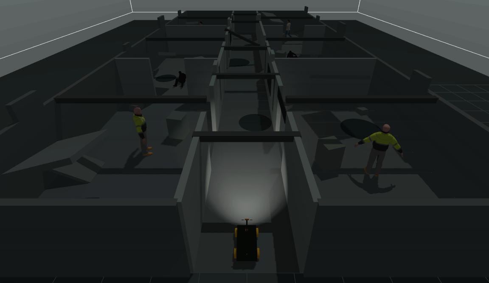
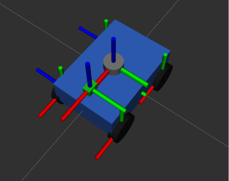
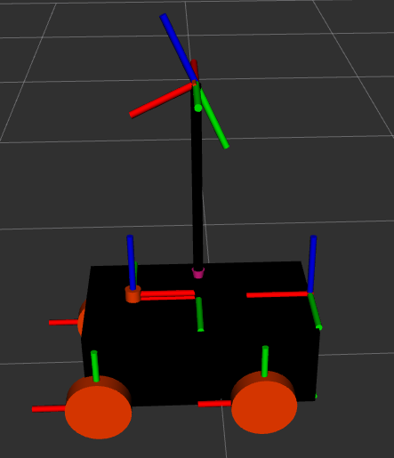
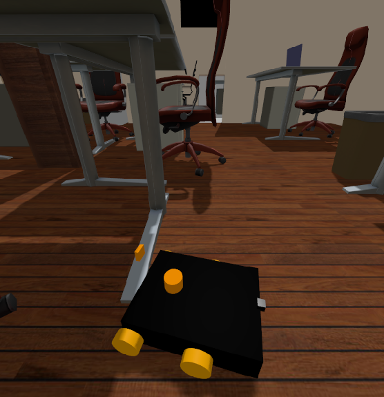
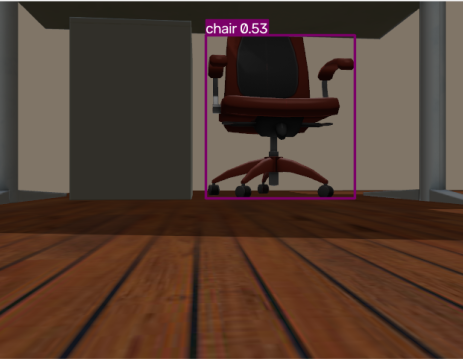
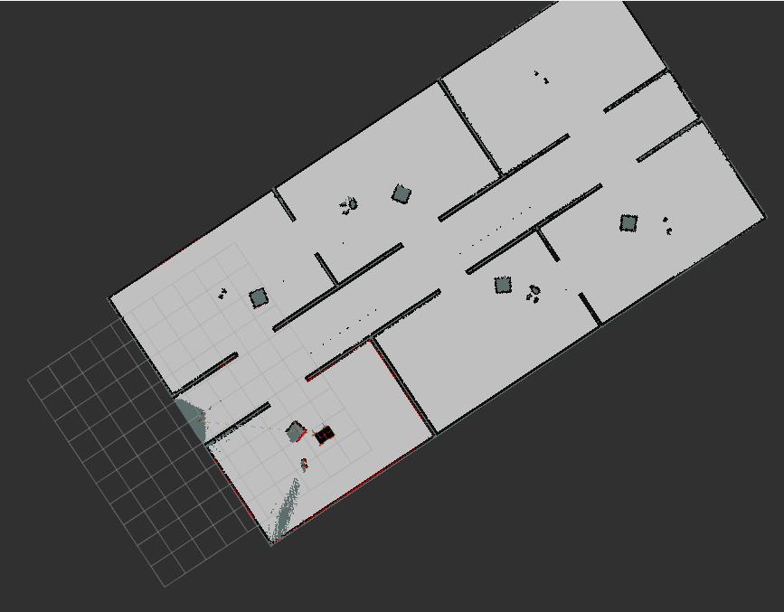
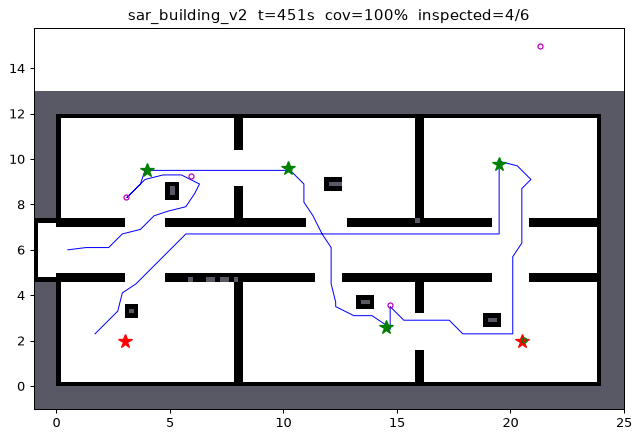
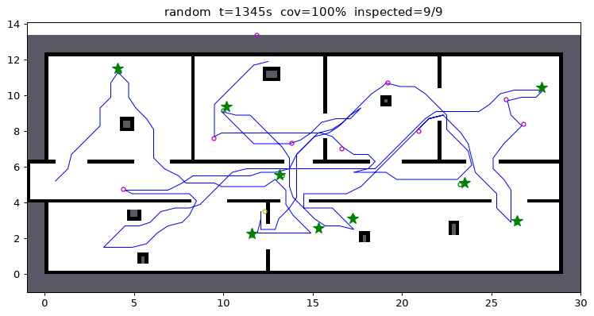
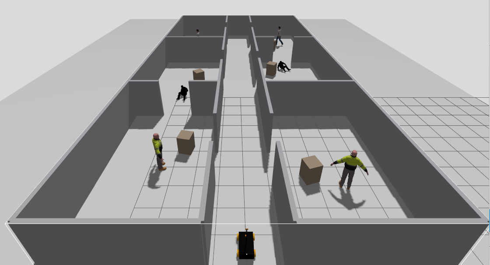
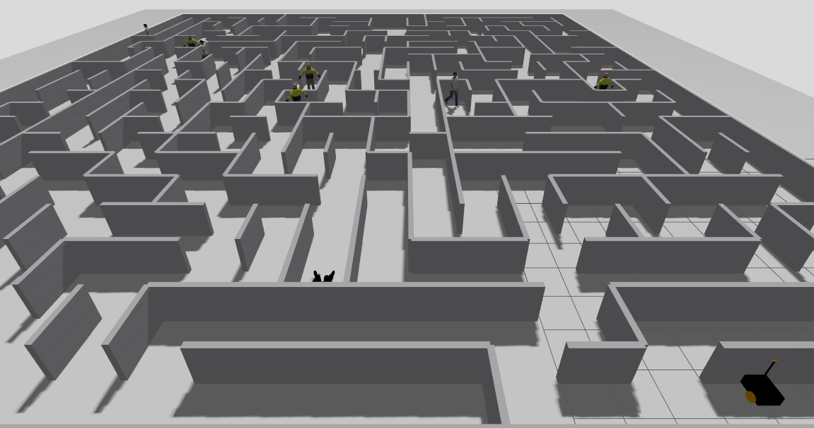

# Search and Rescue Rover: Hand-Designed vs Learned Goal Selection for Autonomous Exploration
An autonomous search and rescue rover built with ROS 2, Gazebo, Nav2, SLAM, RGB-D perception and reinforcement learning.

The main experiment compares a hand designed frontier exploration policy, Mission 2, with a PPO policy. Both choose from the same candidate goals and use the same navigation stack.

## Demo

<p align="center">
  <video src="https://github.com/user-attachments/assets/8fd30b4a-ade5-483c-b9b0-d97bcb02ba8d
" controls width="90%"></video>
</p>

<p align="center">
  <em>Autonomous search-and-rescue rover exploring a low-visibility environment, detecting targets and navigating using ROS 2, SLAM and Nav2.</em>
</p>

<p align="center">
  
</p>

<p align="center">
  <em>Final low-visibility search-and-rescue environment used for the demonstration.</em>
</p>

## Research question

Can PPO choose exploration goals better than the hand-designed Mission 2 rule?

The main metrics are target detection, target inspection, time, distance travelled and stuck events. Coverage is also recorded, but high coverage alone is not considered a successful SAR mission. Only the goal-selection step differs between the two policies.

## System overview
<p align="center">
  
</p>


```
 LiDAR + RGB-D camera + IMU
        |
   SLAM Toolbox + EKF  ->  occupancy map, robot pose
        |
   YOLO + ByteTrack + depth  ->  semantic database (person entries with map coordinates)
        |
   Candidate generator (shared)
        |   up to 8 frontier candidates + up to 8 target candidates
        |
   +----+---------------------+
   |                          |
 Mission 2 rule             PPO policy
 (hand-designed)            (learned)
   |                          |
   +----------+---------------+
              |
        goal pose -> Nav2 (Smac 2D planner, MPPI controller) -> rover
```

Everything below the goal selection (Nav2, stuck watchdog, LiDAR-directed recovery, perception, target inspection, result logging) is shared and unchanged between the two policies.

## Robot and software stack

| Component | Details |
|---|---|
| Platform | 4-wheel differential-drive rover, URDF/xacro in `src/minibot`. Simulated mass: 19.7 kg chassis plus four 1.5 kg wheels (about 26 kg with mast and sensors) |
| OS / middleware | Ubuntu 24.04, ROS 2 Jazzy |
| Simulator | Gazebo (default pairing for Jazzy), `ros_gz` bridge |
| Drive | `ros2_control` `diff_drive_controller`, `twist_mux` |
| Sensors | 2D LiDAR (360 samples, 10 m), RGB-D camera on a 0.67 m mast (tilted down 25 degrees), IMU, two mast-mounted spot lights |
| State estimation | `robot_localization` EKF (wheel odometry + IMU) |
| Mapping | SLAM Toolbox, online asynchronous mapping, 0.05 m resolution |
| Navigation | Nav2: Smac 2D planner, MPPI controller (`vx_max` is 0.7 m/s in the shipped config; experiments were run at 0.5 and 0.7 m/s) |
| Perception | Ultralytics YOLO (`yolo26n`, PyTorch and an OpenVINO export are included) with ByteTrack tracking and depth-based localisation, `semantic_perception` package |
| Learning | PyTorch (training), NumPy (inference inside ROS) |

## Robot development

The rover went through several iterations during development. The initial
configuration used a smaller chassis and a low-mounted camera. This caused
problems when navigating around low obstacles and gave the RGB camera a poor
viewpoint for target detection.

The final configuration uses a larger rover body with RGB-D sensing and a
mast-mounted camera to improve both local obstacle perception and target
detection.

<p align="center">
  
  
</p>

<p align="center">
  <em>Initial rover configuration (left) and final rover configuration with mast-mounted sensing (right).</em>
</p>

### Early perception experiments

Early testing exposed limitations in the original camera placement. The
low-mounted camera could detect objects, but its viewpoint was not suitable
for the final search-and-rescue configuration.

<p align="center">
  
  
</p>

<p align="center">
  <em>Early low-mounted camera view (left) and YOLO detection during initial perception testing (right).</em>
</p>

### Perception and inspection

| Step | Behaviour |
|---|---|
| Detection | YOLO with ByteTrack IDs, detection confidence threshold 0.5. The 3D position comes from the aligned depth image and is transformed into the map frame |
| Database | `semantic_database` merges detections into `person` entries and publishes them to the explorer |
| Snapshot | Captured while approaching, as soon as the detection confidence is at least 0.6 and the depth distance is at most 3.0 m. There is no stop-and-rotate alignment step |
| Goal | A stand-off point at 0.65 x the inspection radius from the entry (inspection radius 1.1 m) |
| Counted as inspected | Nav2 reports the goal reached, the goal is within the inspection radius, and the entry already has a snapshot |
| Failure | Otherwise the attempt counts as failed; after 2 failed attempts the entry is abandoned |

An earlier version used a stop-and-rotate verification step. It was removed because a failed verification could repeatedly block the mission.

### Robot design changes

| Earlier design | Current design | Reason |
|---|---|---|
| Camera low on the chassis; collisions with low-lying objects | Camera on a mast, plus an RGB-D camera | Better view of the scene; low objects that the single-plane LiDAR does not see are now observed |
| 2D LiDAR plane only for object geometry | RGB-D depth for localising detected people | The LiDAR plane is not suited to locating low objects |
| Detections treated frame by frame | ByteTrack IDs (`bytetrack.yaml`, persistent tracks) | Stable object identity over time |
| Database doing a lot of de-duplication | Cleaner upstream perception (tracking, depth position, confidence and distance gates for snapshots) | The database should not have to compensate for bad measurements |
| Centre of mass too far forward | Centre of mass moved back | Stable behaviour in simulation (table below) |

Centre-of-mass position versus stability across four versions of the robot model in simulation. The rear-load figure is an estimate of the share of weight on the rear axle.

| Model version | Wheelbase (m) | Centre of mass to rear (m) | Estimated rear load | Behaviour in simulation |
|---|---|---|---|---|
| Version 1 | 0.372 | 0.059 | about 84% | stable |
| Version 3 | 0.500 | 0.059 | about 88% | stable |
| Latest | 0.500 | 0.059 | about 88% | stable |
| Version 2 | 0.500 | 0.309 | about 38% | unstable |

## Exploration methods

### Mission 2 (hand-designed baseline)

Implemented in `src/frontier_explorer/frontier_explorer/mission2.py`.

1. If there are known, uninspected, non-abandoned `person` targets above a low confidence floor (0.10), go to the one with the shortest Nav2 path and inspect it.
2. Otherwise explore: score each frontier candidate with

   `U = alpha * IG_norm - beta_eff * Cost_norm`

   with `alpha = 3.0`, `beta = 0.25` (scaled up as the battery model drains), `IG_norm` the visible-unknown-cell count from 180 LiDAR-like rays (10 m range) divided by the ray count, and `Cost_norm` the Nav2 path length divided by the longest candidate path. Go to the highest-scoring frontier.
3. A target that cannot be reached or confirmed after 2 attempts is abandoned. A frontier that causes a stuck event is blacklisted for 30 s. The mission ends after 3 consecutive cycles with no frontier or target left.

### Shared candidate generation

Both policies receive the same candidate set, built as in Mission 2 (with the target list capped at 8):

- Frontier cells are clustered; visited and blacklisted clusters are dropped.
- The 15 largest clusters get a safe goal cell (obstacle margin) and an information-gain estimate.
- The 8 with the highest information gain become the frontier candidates.
- Every available target gets a stand-off point; the 8 with the shortest Nav2 path become the target candidates.

This gives a 16-slot action space (8 frontier + 8 target, masked when empty).

### PPO policy

Implemented in `sar_training/sar_rl/policy.py` and trained with `sar_training/train_ppo.py`.

- A shared encoder scores every candidate; two self-attention layers let the candidates see each other; a masked softmax picks one.
- Input per candidate (13 numbers): target flag, Nav2 path length (absolute and relative), visible information gain, cluster size, offset to the robot (x, y), target confidence, failed attempts, clearance at the goal, minimum clearance along the path, target offset from free space, distance to previously chosen goals.
- Global input (10 numbers): known free area, number of frontier candidates, battery, elapsed time, available targets, inspected and abandoned counts, stuck events, decisions so far, empty cycles.
- The reward is task-based: positive for each person inspected (more if early) and for map coverage gained; penalties for time, distance, stuck events and abandoned targets. No Mission 2 utility formula is used in training.
- The checkpoint evaluated below (`run16_baseline`, exported as `sar_training/policy16.npz`) was trained from scratch for 800,000 decisions with the default reward weights.

For deployment the policy is exported to a `.npz` file and run with NumPy inside the ROS node (`sar_training/gazebo_deploy/`), so PyTorch is not needed on the robot.

## Autonomous exploration

The rover builds an occupancy map with SLAM Toolbox while navigating the
environment and selecting new exploration goals.

<p align="center">
  
</p>

<p align="center">
  <em>RViz occupancy map produced during an autonomous exploration run, reaching about 96% map coverage.</em>
</p>

## 2D simulation environment

PPO is trained in a faster 2D simulator, `sar_training/sar_rl/`, because a Gazebo mission takes tens of minutes. One simulator step is one goal decision.

- **Copied from the Mission 2 node:** frontier detection and clustering, goal-cell safety filter, information-gain ray casting, visited/blacklist logic, target availability rules, stand-off point, completion rule. The simulator's ports of these functions were compared against the originals on 207 map snapshots and gave identical clusters, safety masks, goal cells and information-gain values.
- **Approximated:** Nav2 (Dijkstra on the known map), stuck events (probability grows with path/goal narrowness), YOLO (range, field of view, line of sight, localisation noise, duplicate and false detections, snapshot failures), driving speed and timing. These are randomised each episode.
- **Maps:** an exact replica of the Gazebo building (`sar_building_v2`) plus procedurally generated corridor-and-room layouts. Training uses the generated layouts; the replica is kept for testing.
- **Calibration:** `CALIBRATED` in `sar_env.py` tunes the physics to one real Gazebo Mission 2 run (about 2000 s, about 13 stuck events, 15 database entries for 6 people). The simulator results below were produced with the default (uncalibrated, easier) configuration, not `CALIBRATED`.

<p align="center">
  
  
</p>
<p align="center"><em>Simulator: the Gazebo building replica (left) and a generated layout (right).</em></p>

### Metrics

Mission time, distance, coverage, people inspected, stuck events, abandoned targets and completion.

## Results

### Simulator: Mission 2 rule vs. PPO (`run16_baseline`)

50 paired episodes per setting (same seeds for both policies), default (uncalibrated) simulator configuration. Values are mean ± standard deviation. People inspected is out of 6 in the building layout (6.18 on average in the generated layouts).

**Building replica, nominal physics**

| | Mission 2 rule | PPO |
|---|---|---|
| Mission time (s) | 613 ± 116 | 730 ± 223 |
| Distance (m) | 104 ± 20 | 135 ± 39 |
| Coverage (%) | 99.99 | 99.96 |
| People inspected | 4.98 ± 0.8 | 5.44 ± 0.8 |
| Stuck events | 4.44 ± 1.9 | 4.52 ± 2.7 |
| Abandoned entries | 2.14 ± 1.3 | 2.58 ± 1.9 |

**Building replica, randomised physics**

| | Mission 2 rule | PPO |
|---|---|---|
| Mission time (s) | 677 ± 211 | 759 ± 243 |
| Distance (m) | 117 ± 29 | 138 ± 35 |
| Coverage (%) | 99.81 | 100.00 |
| People inspected | 4.90 ± 1.0 | 5.22 ± 1.0 |
| Stuck events | 4.34 ± 3.1 | 4.60 ± 3.2 |
| Abandoned entries | 3.24 ± 2.7 | 3.72 ± 2.5 |

**Generated layouts, randomised physics**

| | Mission 2 rule | PPO |
|---|---|---|
| Mission time (s) | 862 ± 314 | 1076 ± 389 |
| Distance (m) | 168 ± 59 | 216 ± 79 |
| Coverage (%) | 97.44 | 97.57 |
| People inspected | 5.20 ± 2.4 | 5.44 ± 2.3 |
| Stuck events | 4.54 ± 2.4 | 6.14 ± 3.3 |
| Abandoned entries | 4.14 ± 2.8 | 4.96 ± 3.0 |

In the simulator, PPO inspected slightly more people, but took longer, travelled farther and had the same or more stuck events. Overall, it did not outperform Mission 2. The training reward at that stage charged very little for time and distance, which is consistent with this behaviour. A second run with a stronger time/distance/stuck penalty on the calibrated simulator is planned.

### Gazebo: PPO vs. Mission 2

One 20-minute run per policy at 0.7 m/s, using PPO policy `run16_baseline`. These results are only a first comparison; repeated runs are needed before drawing conclusions. "Targets" are semantic-database entries, which can include duplicate and false detections; the world contains 6 people.

| Metric | Mission 2 | PPO |
|---|---|---|
| Run time (s) | 1211.96 | 1212.77 |
| Distance traveled (m) | 48.39 | 49.91 |
| Final map coverage (%) | 85.69 | 96.96 |
| Targets detected | 9 | 10 |
| Targets inspected | 6 | 5 |
| Targets abandoned | 3 | 2 |
| First detection (s) | 38.87 | 74.84 |
| First inspection (s) | 79.45 | 109.71 |
| PPO decisions | n/a | 33 |

In these runs, PPO achieved higher coverage, while Mission 2 detected and inspected targets earlier and inspected one more target. Runtime and distance were similar. With one run per policy, this is not enough to determine which policy is better.

Distance traveled is the sum of the planned path lengths of goals that Nav2 reported as reached, so it does not include travel on goals that ended in a stuck event or a failure.

**The same PPO policy at two forward velocities.** The forward velocity was changed from 0.5 to 0.7 m/s between these two runs, so they are different experimental conditions, and each is a single run.

| Metric | PPO, 0.5 m/s | PPO, 0.7 m/s |
|---|---|---|
| Run time (s) | 1255.97 | 1212.77 |
| Distance traveled (m) | 45.39 | 49.91 |
| Final map coverage (%) | 70.46 | 96.96 |
| Targets detected | 11 | 10 |
| Targets inspected | 2 | 5 |
| Targets abandoned | 4 | 2 |

**Earlier Mission 2 reference run** (the run used to calibrate the simulator; single run):

| Metric | Value |
|---|---|
| Runtime | 1999.8 s (33.3 min) |
| Distance traveled | 93.5 m |
| Final map coverage | 97.35 % |
| Targets detected / inspected / abandoned | 15 / 11 / 4 |
| First detection / first inspection | 24.8 s / 51.8 s |
| Stuck events (watchdog) | 13 |
| Average decision latency | 186 ms |

Mission 2 results differ a lot between this run and the 0.7 m/s run above (for example 97% against 86% coverage), which shows how much single runs vary.

### Compute: decision latency

Decision latency of the explorer (frontier detection, information gain, Nav2 path planning) on a laptop CPU, without perception running and with the PyTorch YOLO model running on the same CPU. The "without YOLO" column gives typical ranges from earlier runs; the other column is the mean of one run.

| Component | Without YOLO (typical) | With PyTorch YOLO on CPU (mean) |
|---|---|---|
| Decision latency | about 250 to 300 ms | 329.1 ms |
| Frontier detection and clustering | about 80 to 150 ms | 73.2 ms |
| Information-gain evaluation | about 45 to 63 ms | 88.9 ms |
| `pick_goal_cell` | about 5 to 15 ms | about 8 to 22 ms |
| Async Nav2 path planning | about 60 to 110 ms | 108.7 ms |

The main measurable effect of running YOLO on the same CPU is slower information-gain evaluation (roughly 45 to 63 ms up to 89 ms).

<details>
<summary>Planner comparison: NavFn vs. Smac 2D (single runs)</summary>

Both runs used YOLO on every frame. Each is a single run, and the final coverage of both (60% and 74%) is well below that of the complete missions above, so no conclusion about the planners is drawn. The shipped configuration uses the Smac 2D planner.

| Metric | NavFn | Smac 2D |
|---|---|---|
| Run time | 21:23.9 | 21:36.5 |
| Distance traveled (m) | 140.02 | 188.67 |
| Final map coverage (%) | 59.66 | 73.55 |
| Frontier decisions (candidate rows logged) | 18 | 47 |
| Targets detected | 9 | 4 |
| Targets inspected | 6 | 2 |
| Targets abandoned | 2 | 2 |
| First detection (s) | 413.38 | 58.78 |
| First inspection (s) | 481.72 | 138.24 |
| Average decision latency (ms) | 251.96 | 278.00 |
| Frontier processing (ms) | 81.62 | 86.40 |
| Path planning (ms) | 99.67 | 105.69 |
| Average utility | 0.7686 | 0.4086 |

</details>

## Gazebo experiments

`sar_training/gazebo_deploy/explorer_rl_node.py` inherits from the Mission 2 node and adds a switch:

| `policy_mode` | What runs |
|---|---|
| `mission2` | The original Mission 2 node, unchanged (reference) |
| `mission2c` | The Mission 2 rule applied to the shared candidate set (fair baseline) |
| `rl` | The PPO policy choosing from the same candidate set |

Each run writes to `~/ares_results/run_NNN/`: `experiment_summary.csv`, `frontier_decisions.csv`, `target_milestones.csv`, and for `mission2c`/`rl` also `rl_decisions.csv`, `rl_candidates.csv` (every candidate, its features and the chosen one) and `rl_globals.csv`.

## Environments

Worlds are in `src/minibot/worlds/`. The two main worlds share the same building: a west entrance, an east-west corridor and six rooms, with doorways of different widths (including one narrow doorway), loop doors between rooms, clutter, and six person models.

| World | Description |
|---|---|
| `baselinebest.sdf` (same as `baseline4.sdf`) | Clean version of the building |
| `gazebo1.sdf` (same as `underground.sdf`) | Same building with floor zones, puddles, debris, grime, fog layers and smoke (low visibility) |
| `baseline1.sdf` to `baseline3.sdf` | Earlier worlds (empty, generated maze, first building version) |

### Environment development

The simulation environment was progressively expanded during development.
Early environments were used to validate the robot, sensing and navigation
stack. Later environments introduced more complex layouts and finally
low-visibility conditions for search-and-rescue testing.

<p align="center">
  
  
</p>

<p align="center">
  <em>Initial clean environment (left) and a more complex exploration layout (right).</em>
</p>

## Repository structure

```
src/
  minibot/             Robot description, Gazebo worlds, launch files, Nav2/SLAM/EKF configs
  frontier_explorer/   Mission 2 explorer node (mission2.py) and earlier versions
  semantic_perception/ YOLO detector node and semantic database
  semantic_interfaces/ Custom messages and services for targets
sar_training/
  sar_rl/              2D simulator, layouts, PPO policy network, vectorised env
  train_ppo.py         PPO training
  eval_sim.py          Compare a trained policy with the Mission 2 rule in the simulator
  check_sim.py         Simulator sanity check
  gazebo_deploy/       Export script, NumPy policy, RL explorer node, launch file
  policy16.npz         Exported PPO policy (run16_baseline)
docs/images/           Figures used in this README
docs/demo.mp4          Demo video
yolo_ros/              Third-party ROS 2 YOLO wrapper (see Credits)
behavior_trees/        Nav2 behavior tree
yolo26n_openvino_model/ , *.pt   YOLO weights
```

## Running the system

### Requirements

Ubuntu 24.04 and ROS 2 Jazzy with Gazebo, `ros_gz`, `ros2_control`, Nav2, `slam_toolbox`, `robot_localization`, `twist_mux` and `twist_stamper`. The notes in `src/minibot/Package_Installation_Instruction.md` cover most of these. YOLO needs `ultralytics` (and `openvino` for the exported model).

### Build

```bash
git clone https://github.com/yuvanbruh/searchandrescuerover.git
cd searchandrescuerover
colcon build --symlink-install
source install/setup.bash
```

### Mission 2 in Gazebo

Each command in its own terminal, with the workspace sourced:

```bash
ros2 launch minibot cam.py        # Gazebo world (gazebo1.sdf), robot, bridge, RViz
ros2 launch minibot ek.py         # EKF, SLAM Toolbox, Nav2
ros2 launch minibot semantic.py   # Mission 2 explorer, YOLO detector, semantic database
```

### PPO (or the fair baseline) in Gazebo

Start the first two launch files as above, then, from the repository root, instead of `semantic.py`:

```bash
ros2 launch sar_training/gazebo_deploy/rl_explorer_launch.py \
  base_module:=frontier_explorer.mission2 \
  policy_mode:=rl \
  model_path:=$PWD/sar_training/policy16.npz \
  script_path:=$PWD/sar_training/gazebo_deploy/explorer_rl_node.py \
  experiment_name:=rl16_01
```

Use `policy_mode:=mission2c` (and drop `model_path`) for the Mission 2 rule on the shared candidates. This launch file also starts the YOLO detector and the semantic database, so do not run `semantic.py` at the same time. Run it from a terminal that does not have a Python virtual environment active.

### Training and evaluating in the simulator

No ROS is needed:

```bash
cd sar_training
pip install numpy scipy matplotlib torch gymnasium

python check_sim.py --episodes 5 --png                 # simulator sanity check
python train_ppo.py --name run1 --total-steps 800000   # PPO training, writes runs/run1/
python eval_sim.py --ckpt runs/run1/final.pt --episodes 50
```

To use a trained policy in Gazebo, export it first:

```bash
python gazebo_deploy/export_policy.py --ckpt runs/run1/final.pt --out policy.npz
```

The export script also checks that the NumPy version reproduces the PyTorch policy.

## Limitations and current work

- The Gazebo comparison between PPO and Mission 2 is one run per policy. It is not enough to say which is better.
- In the simulator the PPO policy is slightly better at finding people but slower, and it does not outperform the hand-designed policy overall.
- `run16_baseline` was trained on the default simulator configuration with the default reward, which barely penalises time and distance. A second run on the calibrated simulator with stronger penalties is planned.
- The simulator replaces Nav2 with a shortest-path planner and models stuck events, YOLO errors and timing statistically. It is calibrated to a single real Gazebo run, so the simulator-to-Gazebo gap is not yet measured.
- Forward velocity was changed from 0.5 to 0.7 m/s partway through the experiments, so earlier and later runs are not directly comparable.
- Hardware deployment is planned but has not been done; everything here is simulation.

### Known issues to fix

- `sim.launch.py` and `camd.py` load `playground.sdf`, which is not in `worlds/`. The experiments use `cam.py`.
- The YOLO detector's default `model_path` is an absolute path on the author's machine; set it to `yolo26n_openvino_model/` in this repository.
- `rl_explorer_launch.py` defaults to paths under `~/last/`; pass `model_path` and `script_path` explicitly as shown above.
- `setup.py` in `frontier_explorer` and `semantic_perception` lists entry points for modules that do not exist (`logs`, `best`).
- `mission2withc.py` is an earlier version of `mission2.py` (inspection radius 0.8 m, obstacle margin 3 cells, fixed goal heading).

## Next steps

Train the second PPO run on the calibrated simulator, then run matched Gazebo experiments (`mission2`, `mission2c`, `rl`, several runs each) in the clean and the low-visibility world. Report coverage, distance, time, inspections, abandonments and stuck events with their spread. After that, deploy on the physical rover.

## Credits and licenses

- The robot description, launch structure and Nav2/SLAM configuration in `src/minibot` are adapted from [YJ0528/minibot](https://github.com/YJ0528/minibot) (MIT; earlier history Apache-2.0, see `src/minibot/LICENSE` and `LICENSE.previous.md`), which follows the [Articulated Robotics](https://articulatedrobotics.xyz/) tutorials. The images and GIFs in `src/minibot/visual_demos/` come from that project, not from this one.
- `yolo_ros/` is [mgonzs13/yolo_ros](https://github.com/mgonzs13/yolo_ros), licensed GPL-3.0.
- Object detection uses [Ultralytics YOLO](https://github.com/ultralytics/ultralytics); check its license terms before redistributing weights.
- `twist_stamper` is by Josh Newans.
- The license for the original code in this repository (`frontier_explorer`, `semantic_perception`, `sar_training`) has not been chosen yet.
